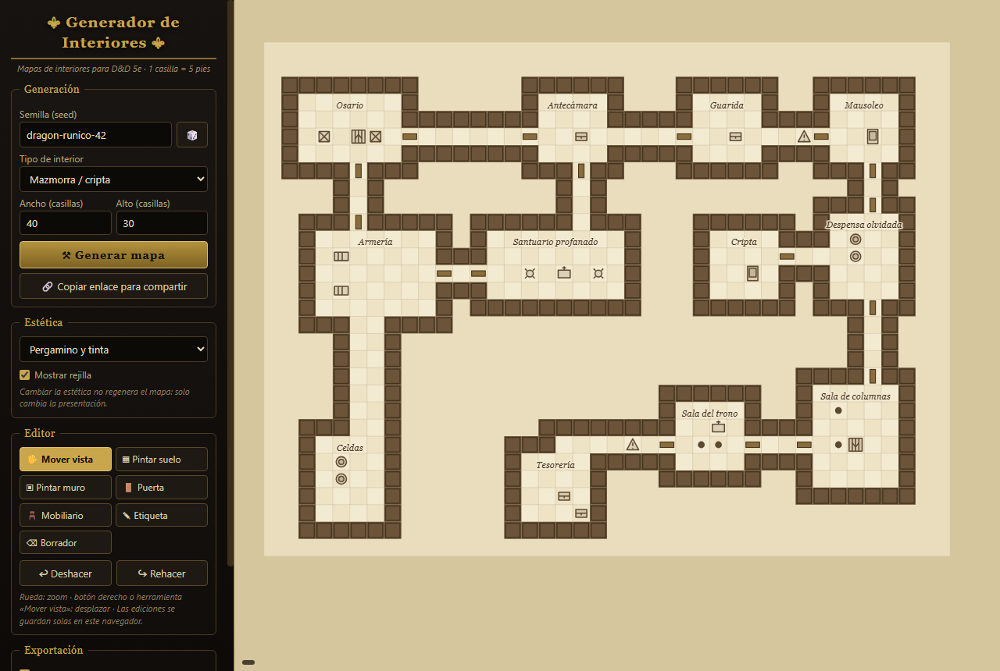
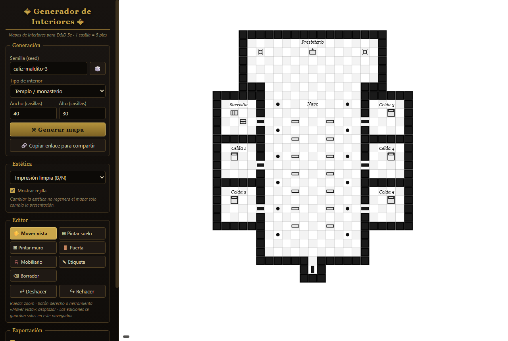
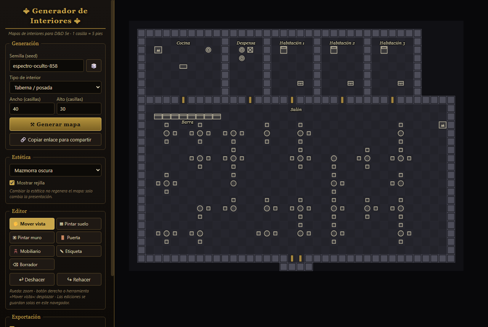
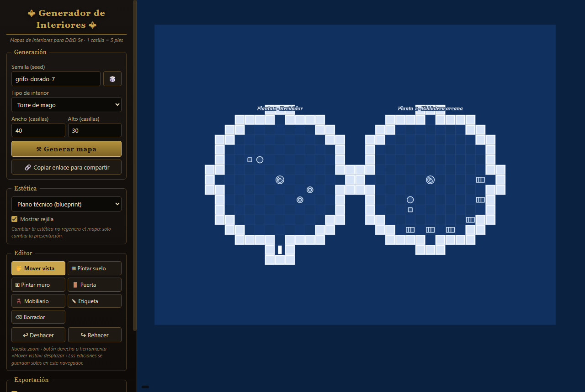

# ⚜ Generador de Interiores ⚜

**Generador procedural de mapas de interiores para juegos de rol de mesa (D&D 5e)**, inspirado en herramientas como Azgaar's Fantasy Map Generator o el One Page Dungeon de Watabou.

🗺️ **Pruébalo aquí:** <https://caarlosalemaany.github.io/generador-interiores/>

Es una web 100 % estática: un único `index.html` sin frameworks, sin dependencias y sin servidor. Funciona igual abriendo el archivo en local que alojado en GitHub Pages.

## ¿Qué hace?

- Genera mapas de interiores sobre una **rejilla de casillas** (1 casilla = 5 pies, tamaño configurable de 20×20 a 60×40).
- La generación es **determinista por semilla (seed)**: la misma seed con los mismos parámetros produce siempre exactamente el mismo mapa. Usa un PRNG sembrable (mulberry32), nunca `Math.random`.
- La seed y los parámetros van **codificados en la URL** (`?seed=...&tipo=...&ancho=...&alto=...&estetica=...`), así que puedes compartir cualquier mapa con un simple enlace.
- Todas las salas reciben **etiquetas automáticas** coherentes con el tipo de edificio («Despensa», «Cripta», «Sala del trono»…) y **mobiliario procedural** acorde (mesas, camas, altares, barriles, cofres, columnas…).
- **Garantía de conectividad**: tras generar, un análisis de componentes conexas comprueba que todas las salas son alcanzables y, si no lo son, excava pasillos hasta conectarlas. Nunca hay salas inaccesibles.

## Tipos de interior (6)

| Tipo | Algoritmo y rasgos |
|---|---|
| **Mazmorra / cripta** | Particiones BSP, salas irregulares (algunas circulares), pasillos conectados por árbol de expansión + bucles, puertas, trampas y escaleras |
| **Taberna / posada** | Gran salón con mesas y sillas, barra frente a la cocina, despensa y habitaciones en el ala superior, chimenea y entrada doble |
| **Casa / mansión** | BSP con muros compartidos y distribución doméstica realista: salón, comedor, cocina, dormitorios, estudio, baño… |
| **Templo / monasterio** | Nave central con columnas y bancos, presbiterio con altar y braseros, sacristía y celdas laterales simétricas |
| **Torre de mago** | Plantas circulares apiladas (recibidor, biblioteca arcana, laboratorio, aposento) unidas por escalera de caracol |
| **Almacén / sótano de contrabandistas** | Filas de estanterías, oficina, barriles y cajas, y un escondite tras una **puerta secreta** con trampilla |

## Estéticas (4)

La estética es solo presentación: **cambiarla nunca regenera el mapa**.

1. **Pergamino y tinta** — fondo crema y trazo sepia, estilo mapa antiguo.
2. **Mazmorra oscura** — fondo negro, muros grises, ambiente lúgubre.
3. **Plano técnico (blueprint)** — fondo azul, líneas blancas.
4. **Impresión limpia** — blanco y negro de alto contraste, pensada para imprimir.

## Editor

Tras generar, el mapa se puede modificar:

- **Herramientas:** pintar/borrar suelo, pintar/borrar muros, colocar/quitar puertas, paleta de **mobiliario** (21 objetos), añadir/mover/editar **etiquetas** de texto y borrador.
- **Deshacer / rehacer** (hasta 30 pasos, también con `Ctrl+Z` / `Ctrl+Y`).
- **Zoom** con la rueda y **desplazamiento** arrastrando (botón derecho o herramienta «Mover vista»).
- Las ediciones **sobreviven al cambio de estética y al zoom**, y se guardan automáticamente en `localStorage`, así que no se pierden al recargar.

## Exportación

- **Descargar PNG** a resolución de impresión (52 px por casilla, más del doble de la resolución de pantalla), con o sin rejilla, respetando la estética activa.
- **Exportar / importar JSON** con el estado completo del mapa (seed, parámetros, casillas, mobiliario y etiquetas) para retomarlo más tarde o compartirlo como archivo.

## Cómo usarlo

1. Abre <https://caarlosalemaany.github.io/generador-interiores/> (o descarga `index.html` y ábrelo con tu navegador: no necesita servidor).
2. Escribe una semilla o pulsa 🎲, elige tipo y tamaño, y pulsa **⚒ Generar mapa**.
3. Ajusta la estética, edita lo que quieras con las herramientas del panel.
4. Pulsa **⬇ Descargar PNG** para llevarlo a la mesa, o **Copiar enlace** para compartirlo.

## Detalles técnicos

- HTML + CSS + JavaScript en un solo archivo, renderizado en `<canvas>`.
- PRNG: hash de cadena **xmur3** → **mulberry32**.
- Distribución de salas: **BSP** (particiones binarias) con muros compartidos o salas exentas según el tipo, grafo de conexión por **árbol de expansión mínima (Prim)** con bucles extra, y puertas detectadas en los estrangulamientos pasillo-sala.
- Conectividad verificada por **BFS de componentes conexas** (las plantas de la torre cuentan como unidas por sus escaleras).

## Licencia

Uso libre para tus partidas. ¡Que los dados te sean propicios! 🎲
