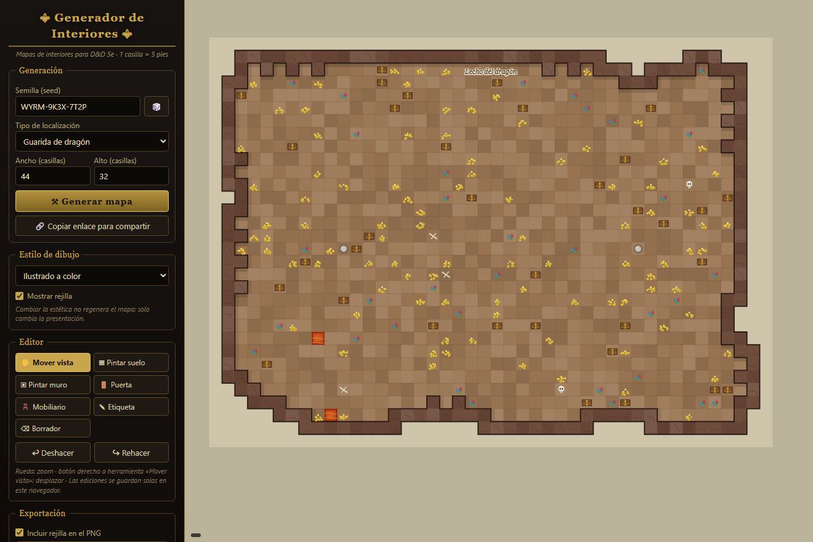
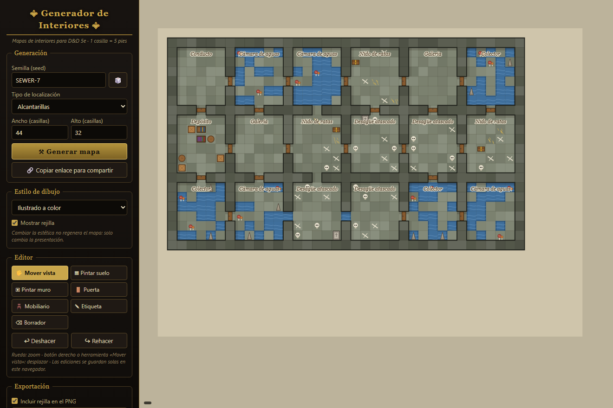
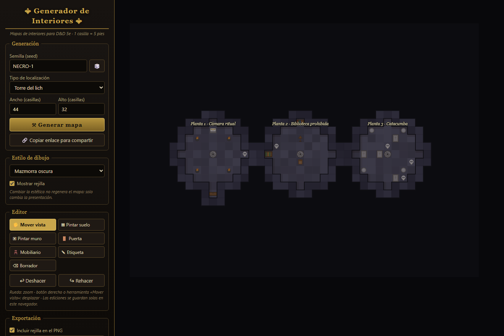
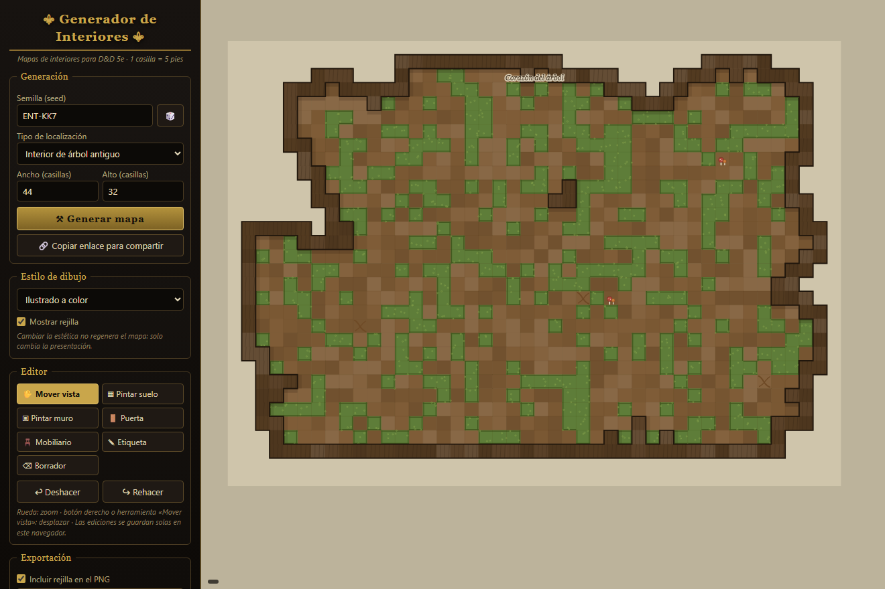
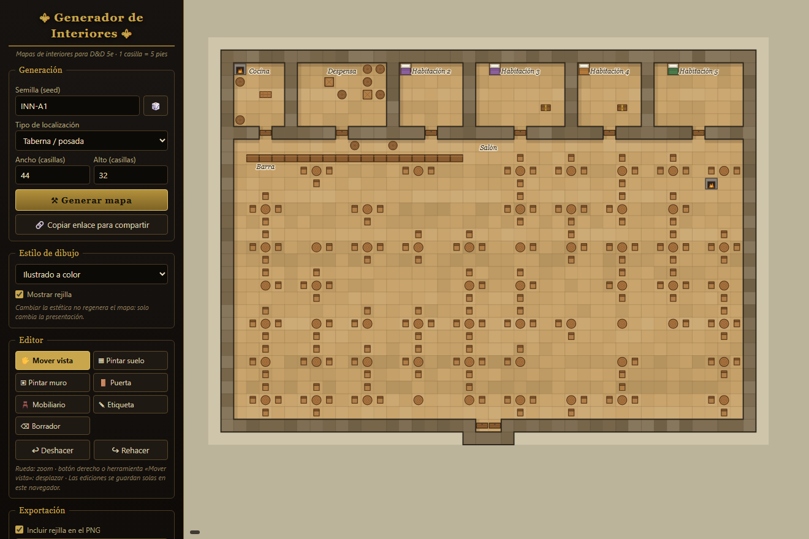
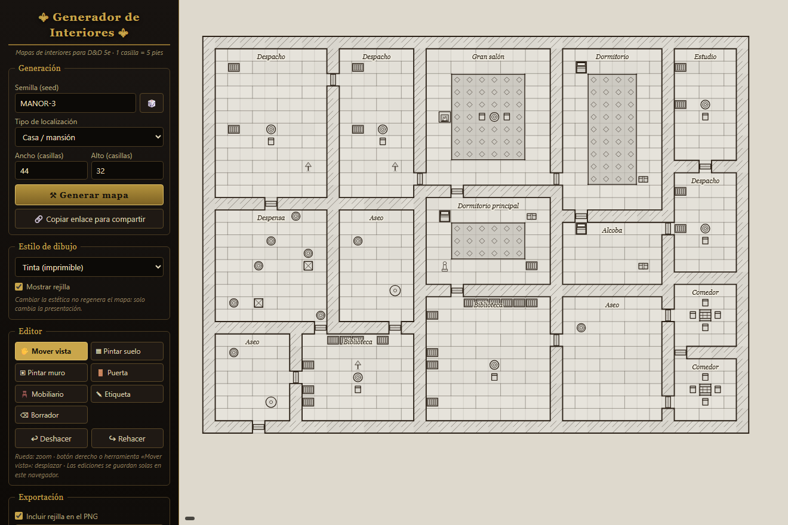
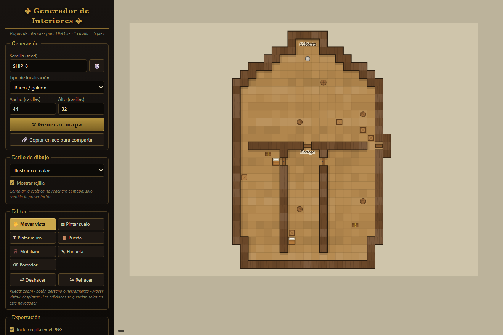

# ⚜ Generador de Interiores ⚜

**Generador procedural de mapas de interiores para juegos de rol de mesa (D&D 5e)**, inspirado en herramientas como Azgaar's Fantasy Map Generator o el One Page Dungeon de Watabou.

🗺️ **Pruébalo aquí:** <https://caarlosalemaany.github.io/generador-interiores/>

Es una web 100 % estática: un único `index.html` sin frameworks, sin dependencias y sin servidor. Funciona igual abriendo el archivo en local que alojado en GitHub Pages. Todo el mapa se **dibuja de forma vectorial a color** directamente en el `<canvas>` (suelos con textura, muros perfilados con sombra, mobiliario ilustrado), al estilo de los generadores procedurales de Watabou — sin usar ninguna imagen externa, así que el PNG exportado y el modo sin conexión siguen funcionando.

## ¿Qué hace?

- Genera mapas de interiores sobre una **rejilla de casillas** (1 casilla = 5 pies, tamaño configurable de 20×20 a 60×40).
- La generación es **determinista por semilla (seed)**: la misma seed con los mismos parámetros produce siempre exactamente el mismo mapa. Usa un PRNG sembrable (mulberry32), nunca `Math.random`.
- La semilla es un **código alfanumérico abstracto** (p. ej. `WYRM-9K3X-7T2P`), con ~3·10¹⁸ combinaciones: cada semilla da un mapa marcadamente distinto. Botón 🎲 para una aleatoria.
- Seed y parámetros van **codificados en la URL** (`?seed=...&tipo=...&ancho=...&alto=...&estetica=...`), así que puedes compartir cualquier mapa con un enlace.
- Cada localización combina un **algoritmo de trazado** con **decoradores de sala** y un vocabulario de etiquetas propio, así que dos seeds del mismo tipo producen distribuciones, salas y mobiliario completamente diferentes.
- **Garantía de conectividad**: tras generar, un análisis de componentes conexas comprueba que todas las salas son alcanzables y, si no lo son, excava pasillos hasta conectarlas. Nunca hay salas inaccesibles.

## 18 tipos de localización

Pensado para cubrir **cualquier escenario de una partida de D&D**, desde una taberna hasta el sanctasanctórum de un lich. Agrupados en el selector:

**Subterráneo** · Mazmorra / cripta · Cueva natural · Catacumbas · Mina abandonada · Alcantarillas · Prisión / calabozos
**Habitado** · Taberna / posada · Casa / mansión · Templo / monasterio · Fortaleza / cuartel · Almacén / contrabandistas · Barco / galeón
**Mágico y arcano** · Torre de mago · Torre del lich · Laboratorio de alquimista
**Guaridas de monstruos** · Guarida de dragón · Nido de goblins · Interior de árbol antiguo

Cada uno usa el algoritmo de trazado que mejor le encaja:

| Algoritmo | Lo usan | Cómo es |
|---|---|---|
| **Salas BSP** | mazmorra, casa, fortaleza, laboratorio… | Particiones binarias en salas (a veces circulares) unidas por pasillos (árbol de expansión + bucles) y puertas, o con muros compartidos en las viviendas |
| **Cueva (autómata celular)** | cueva, guarida de dragón, árbol, mina, nido de goblins | Cavernas orgánicas irregulares; el dragón obtiene una gran cámara para su tesoro |
| **Torre de plantas** | torre de mago, torre del lich | Plantas circulares apiladas unidas por escalera de caracol |
| **Sala grande + crujía** | taberna, templo | Un gran salón/nave central con una banda de salas anexas |
| **Rejilla de celdas** | catacumbas, prisión, alcantarillas | Retícula de celdas con red de pasillos (las alcantarillas añaden canales de agua) |
| **Casco de barco** | barco / galeón | Silueta de casco con proa apuntada, cubierta, bodega y camarotes |

El mobiliario se dibuja como ilustración reconocible (más de 40 objetos): mesas redondas y largas, sillas, **camas con manta y almohada**, **estanterías con libros de colores**, tronos, barriles con aros, cofres y **montones de tesoro y gemas**, chimeneas, forjas y braseros con fuego, calderos, alambiques, columnas y estatuas, sarcófagos, **huesos y calaveras**, jaulas, hongos, estalagmitas, raíces, círculos mágicos, trampas… y capas de suelo que se funden entre casillas: **alfombras, agua, lava, musgo y sangre**.

## Estilos de dibujo (4)

Lo que cambia el selector de estilo es el **dibujo**, no el mapa: **cambiarlo nunca regenera nada**, solo reinterpreta por luminancia la paleta base de cada material.

1. **Ilustrado a color** — el estilo por defecto, con suelos texturizados (madera, piedra, tierra, corteza, mármol…), sombras y mobiliario a todo color.
2. **Pergamino envejecido** — vira la paleta a sepia, como un mapa antiguo dibujado a mano.
3. **Tinta (imprimible)** — blanco y negro de alto contraste con muros rayados a la manera de un grabado, pensado para imprimir.
4. **Mazmorra oscura** — fondo negro y ambiente lúgubre, conservando el color del mobiliario.

## Editor

Tras generar, el mapa se puede modificar:

- **Herramientas:** pintar/borrar suelo, pintar/borrar muros, colocar/quitar puertas, paleta de **mobiliario** (más de 40 objetos, incluidas las capas de suelo: alfombra, agua, lava, musgo y sangre), añadir/mover/editar **etiquetas** de texto y borrador.
- **Deshacer / rehacer** (hasta 30 pasos, también con `Ctrl+Z` / `Ctrl+Y`).
- **Zoom** con la rueda y **desplazamiento** arrastrando (botón derecho o herramienta «Mover vista»).
- Las ediciones **sobreviven al cambio de estilo y al zoom**, y se guardan automáticamente en `localStorage`, así que no se pierden al recargar.

## Exportación

- **Descargar PNG** a resolución de impresión (52 px por casilla, más del doble de la resolución de pantalla), con o sin rejilla, respetando el estilo de dibujo activo.
- **Exportar / importar JSON** con el estado completo del mapa (seed, parámetros, casillas, mobiliario y etiquetas) para retomarlo más tarde o compartirlo como archivo.

## Cómo usarlo

1. Abre <https://caarlosalemaany.github.io/generador-interiores/> (o descarga `index.html` y ábrelo con tu navegador: no necesita servidor).
2. Escribe una semilla o pulsa 🎲, elige tipo y tamaño, y pulsa **⚒ Generar mapa**.
3. Ajusta el estilo de dibujo, edita lo que quieras con las herramientas del panel.
4. Pulsa **⬇ Descargar PNG** para llevarlo a la mesa, o **Copiar enlace** para compartirlo.

## Detalles técnicos

- HTML + CSS + JavaScript en un solo archivo, renderizado en `<canvas>`.
- **Render ilustrado vectorial**: cada estilo de dibujo transforma una paleta base de color (a sepia, a tinta o a oscuro) mediante una función de remapeo por luminancia, sin tocar la geometría del mapa. Las texturas de suelo/muro y las vetas de la madera se generan con un hash determinista por casilla, así que son estables entre repintados.
- PRNG: hash de cadena **xmur3** → **mulberry32**. La seed se combina con tipo y tamaño antes de sembrar.
- **Motor por temas**: cada tipo declara su material (suelo/muro y su textura), elige un algoritmo de trazado y reparte roles de sala con pesos aleatorios; los decoradores amueblan cada sala de forma procedural. De ahí la variedad entre seeds.
- Algoritmos de trazado: **BSP** (salas con pasillos por árbol de expansión de Prim + bucles, o muros compartidos con puertas), **autómata celular** para cuevas orgánicas, **plantas circulares** apiladas, **sala grande + crujía** y **rejilla de celdas**.
- Conectividad verificada por **BFS de componentes conexas**; si algo queda aislado se excavan pasillos hasta unirlo (las plantas de la torre cuentan como unidas por sus escaleras).

## Licencia

Uso libre para tus partidas. ¡Que los dados te sean propicios! 🎲
